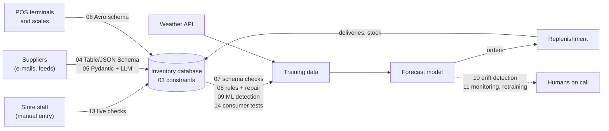

# Data Quality: code for the lecture

Runnable examples for the lecture *Data Quality* in *Machine Learning in Production*
(readings: Sambasivan et al., ["Everyone wants to do the model work, not the data work":
Data Cascades in High-Stakes AI](https://research.google/pubs/everyone-wants-to-do-the-model-work-not-the-data-work-data-cascades-in-high-stakes-ai/),
CHI 2021, and the book chapter [Data Quality](https://mlip-cmu.github.io/book/16-data-quality.html)).

**Case study: inventory management.** A supermarket chain trains an ML model to predict
future sales, and decides what to restock, when, and how many. All projects use the same
synthetic, deterministic dataset ([`inventory-data`](inventory-data/)): 8 stores in
Pennsylvania and Ohio, 60 products, 12 suppliers, two years of sales, deliveries, stock
counts, and weather, plus dirty copies with a ground truth of every injected error and a
drift scenario with documented events.

## How to run

You can read everything on GitHub without running it:

- the notebooks (`01`, `10`, `11`, `12`) are committed with their outputs;
- the data is committed as CSV files in [`inventory-data/data/`](inventory-data/data/), and
  [`inventory-data/data/preview/`](inventory-data/data/preview/) has small extracts that
  GitHub shows as a table.

To run the code, install [uv](https://docs.astral.sh/uv/). Every folder is its own uv project
(Python 3.13); `uv run` installs its dependencies.

```sh
cd 07-dataframe-validation
uv run gx_validate.py                         # scripts
cd ../10-drift-detection
uv run jupyter lab drift_detection.ipynb      # notebooks
cd ../13-data-entry-app
uv run streamlit run app.py                   # the app
./run_all.sh                                  # run every demo and notebook (as the CI does)
./run_all.sh 03-sql-schema 08-quality-rules-and-repair
```

## Slides → code

| Slides | Project | Tools |
|---|---|---|
| Accuracy vs. Precision; Data Accuracy and Precision: Impact on ML; Data Quality vs Quantity | [`01-accuracy-vs-precision`](01-accuracy-vs-precision/) | scikit-learn, Jupyter |
| What do we mean by clean data?; Data comes from many sources; Data is noisy | [`02-quality-dimensions`](02-quality-dimensions/) | DuckDB |
| Schema in Relational Databases; Data Schema; Schema Problems; What Happens When New Data Violates Schema? | [`03-sql-schema`](03-sql-schema/) | DuckDB, SQLite |
| Modern Databases: Schema-Less; Schema-Less Data Exchange; CSV Schema | [`04-schemaless-exchange`](04-schemaless-exchange/) | pandas, Frictionless, JSON Schema |
| Pydantic (both slides) | [`05-pydantic-llm`](05-pydantic-llm/) | Pydantic, LiteLLM, Anthropic SDK, FastAPI |
| Apache Avro (e.g. for Kafka); Many Schema Libraries/Formats | [`06-avro-parquet`](06-avro-parquet/) | fastavro, Parquet |
| Schema Checks after Loading; Summary: Schema | [`07-dataframe-validation`](07-dataframe-validation/) | Great Expectations, Pandera |
| Wrong and Inconsistent Data; Example Tool: Great Expectations; Rule-based detection; Example: HoloClean | [`08-quality-rules-and-repair`](08-quality-rules-and-repair/) | DuckDB SQL, rapidfuzz |
| Detecting Inconsistencies; ML-based for Detecting Inconsistencies; Not many standard tools | [`09-ml-error-detection`](09-ml-error-detection/) | scikit-learn, PyOD, Splink |
| Dealing with Drift; Types of Drift; Indicators of Concept/Data Drift; Detecting Data Drift; Drift Detection Tools | [`10-drift-detection`](10-drift-detection/) | scipy, river, Evidently |
| Dealing with Drift (retrain, monitor, thresholds, humans); Azure Data Drift Dashboard | [`11-dealing-with-drift`](11-dealing-with-drift/) | Evidently UI, river |
| Poor Data Quality has Consequences; GIGO: Target Canada; Raw Data is an Oxymoron; Data Cascades | [`12-data-cascades`](12-data-cascades/) | simulation, Jupyter |
| GIGO: Target Canada (no validation at entry); Conflicting Reward Systems | [`13-data-entry-app`](13-data-entry-app/) | Streamlit, Pydantic |
| Data Documentation; Data Quality Documentation; Data Card; Poor Cross-organizational Documentation | [`14-data-documentation`](14-data-documentation/) | Data Card, Pandera, pytest |

## Where the checks live

Data quality is a system-wide concern: each check sits at an interface between components.



`12-data-cascades` simulates the whole loop, including what happens when checks are missing.

